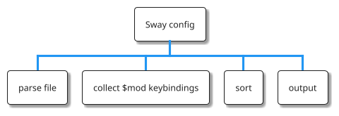

I thought I would provide an example of how I typically use elisp to make my life easier (well eventually - I still need to write the function after all!)

<!--more-->



In the example below, I wanted to find a simple elispy method to determine which Sway keybindings are available, specifically those that utilize the $mod key (typically Mod4/Super). Running out of available $mod keybindings in Sway, and then realizing upon reload that I have inadvertently added a duplicate keybinding, can be quite frustrating.

When this happens, I usually then have to resort to scrolling through the config file or using \`isearch\` to determine which keybindings are available.  This can be tedious and is made more difficult in that my keybindings are not listed alphabetically but are grouped by function.

I am having a similar problem with Emacs but that is where the package **free-keys** comes in handy, listing the free and available keybindings.

---

I initially wanted to create something similar to **free-keys** for Sway, but by parsing the Sway configuration file and generating a report.

A Sway config file is typically defined in the following format:

```cfg
# Set Defaults
set $mod Mod4
set $left h
set $down j
set $up k
set $right l

# Key bindings
bindsym $mod+b exec toggle_waybar.sh
bindsym $mod+c exec screen-record.sh
bindsym $mod+e exec thunar ~/DCIM/Camera
bindsym $mod+m exec emacs
bindsym $mod+n exec firefox
bindsym $mod+p exec wl-color-picker
bindsym $mod+q kill
bindsym $mod+return exec $term

# Change window focus
bindsym $mod+Left focus left
bindsym $mod+Down focus down
bindsym $mod+Up focus up
bindsym $mod+Right focus right
bindsym $mod+$left focus left
bindsym $mod+$down focus down
bindsym $mod+$up focus up
bindsym $mod+$right focus right
```

For now, to keep things simple, I will focus solely on writing elisp to list the current Sway keybindings that use Mod4 or any alias for Mod4 in alphabetical order. Then, by visually scanning and leveraging the human brain's familiarity with the alphabet, I can determine which keybindings are unused!

For example, my new elisp function could yield the following typical output for the sway snippet defined above:

```cfg
Mod4+Down
Mod4+Left
Mod4+Right
Mod4+Up
Mod4+b
Mod4+c
Mod4+e
Mod4+h
Mod4+j
Mod4+k
Mod4+l
Mod4+m
Mod4+n
Mod4+p
Mod4+q
Mod4+return
```

Now I should be able to more easily gauge which bindings are not used.

Of course my full Sway config has many more Mod4 keybindings and when running the elisp function defined below I realised I now only have 3 alphabetical mappings left for $mod - eeek!, but at least I now know what they are and don't have to go trawling through the config anymore.

...wait, um, just as a side note, while I'm editing this blog post, it has just occurred to me (pardon the pun), can I use **occur**, push to a buffer then re-order, mmmm....., well lets ignore that thought for now, I want to dig into some elisp, its a learning experience after all!!

Here is the elisp:

```elisp
(defun swaywm-list-mod-bindsyms (path)
  "List all bindsyms that start with $mod or its resolved value in the SwayWM config file at PATH."
  (interactive "fSway config file path: ")
  (with-temp-buffer
    (insert-file-contents path)
    (goto-char (point-min))
    (let ((vars nil)
          (bindsyms nil))
      ;; Collect variable definitions
      (while (re-search-forward "^set \\$\\([a-zA-Z0-9_]+\\) \\(.*\\)$" nil t)
        (let ((var (match-string-no-properties 1))
              (value (match-string-no-properties 2)))
          (setq vars (cons (cons var value) vars))))
      ;; Prepare to translate $mod and other keys
      (let* ((mod (cdr (assoc "mod" vars)))
             (left (cdr (assoc "left" vars)))
             (down (cdr (assoc "down" vars)))
             (up (cdr (assoc "up" vars)))
             (right (cdr (assoc "right" vars)))
             (mod-re (format "\\(%s\\|$mod\\)" (regexp-quote mod))))
        (goto-char (point-min))
        ;; Collect all bindings that start with $mod or its resolved value
        (while (re-search-forward (format "^bindsym %s\\+\\([^ ]+\\) \\(.*\\)$" mod-re) nil t)
          (let* ((mod-key (match-string-no-properties 1))
                 (action (match-string-no-properties 2))
                 (full-key (concat mod "+" action)))
            ;; Replace variable references in keys
            (setq full-key (replace-regexp-in-string "\\$left" left full-key))
            (setq full-key (replace-regexp-in-string "\\$down" down full-key))
            (setq full-key (replace-regexp-in-string "\\$up" up full-key))
            (setq full-key (replace-regexp-in-string "\\$right" right full-key))
            ;; Replace $mod with the actual mod key or keep as $mod for clarity
            (setq full-key (replace-regexp-in-string "\\$mod" mod full-key))
            ;; Collect the key-action pair
            (setq bindsyms (cons (format "%s" full-key) bindsyms)))))
      ;; Return reversed to maintain order
      (mapconcat 'identity (sort (nreverse bindsyms) 'string-lessp) "\n"))))
```

and to call just by:

```elisp
(swaywm-list-mod-bindsyms "~/.config/sway/config.d/default")
```

or interactively.

I might evolve this a little more over the coming weeks (and actually maybe this is where **occur** and in-house Emacsing may at last have its limitations!).  There is potentially a lot to do, for example some such improvements could be :

-   iterate over multiple files to accommodate a typical distributed Sway configuration set
-   show bindings that are free - just like **free-keys**
-   make more generic for multiple different types of config files containing bindings such as :
    -   hyprland
    -   other tiling window managers that typically define bindings in config files
    -   emacs ?!
-   translate all aliases not just the common $left, $right, $up, $down

---

Here is a mini manual for this function :

---

<div class="ox-hugo-toc toc local">

- [Manual for swaywm-list-mod-bindsyms](#manual-for-swaywm-list-mod-bindsyms)
    - [Synopsis](#synopsis)
    - [Description](#description)
    - [Parameters](#parameters)
    - [Usage](#usage)
    - [Example](#example)
    - [Notes](#notes)

</div>
<!--endtoc-->

---


## Manual for swaywm-list-mod-bindsyms {#manual-for-swaywm-list-mod-bindsyms}

List and sort bindsym commands from a SwayWM configuration file that are assigned to the mod key.


### Synopsis {#synopsis}

```elisp
(swaywm-list-mod-bindsyms PATH)
```


### Description {#description}

The \`swaywm-list-mod-bindsyms\` function parses a specified SwayWM configuration file and extracts all \`bindsym\` commands that begin with the modifier key (usually designated as \`$mod\` in SwayWM configurations). The resolution of the \`$mod\` key, along with other potential sway variables like \`$left\`, \`$down\`, \`$up\`, and \`$right\`, is dynamically handled according to their definitions within the file. The commands are then returned as a single string, with each bindsym command on a new line, sorted alphabetically.

This function is particularly useful for users of the Sway Window Manager who wish to quickly audit their keybindings associated with the mod key — a common requirement for optimizing workflow efficiency or for documentation purposes.


### Parameters {#parameters}

-   \`PATH\`: Path to the SwayWM configuration file to be parsed.


### Usage {#usage}

To use \`swaywm-list-mod-bindsyms\`, call the function with the path to your SwayWM configuration file as its argument. For interactive use:

```elisp
M-x swaywm-list-mod-bindsyms
```

When prompted, enter the full path to your SwayWM configuration file. The output will be shown, depending on the Emacs settings, either directly in the minibuffer (for shorter lists) or in a separate buffer for longer outputs.


### Example {#example}

Assuming there's a SwayWM configuration file located at \`~/sway/config\`, you would use the function as follows:

```elisp
M-x swaywm-list-mod-bindsyms RET ~/sway/config RET
```

The returned value will be a sorted list of all \`bindsym\` commands associated with the \`$mod\` key or its resolved value (e.g., \`Mod4\`) from the file, neatly formatted for easy inspection.


### Notes {#notes}

-   This function assumes a standard formatting of the SwayWM configuration file, as deviations might affect the parsing logic.
-   The sorting is done in a case-sensitive alphabetical order, following Emacs' \`string-lessp\` function conventions.
-   All modifications to variables like \`$mod\`, \`$left\`, \`$down\`, \`$up\`, and \`$right\` are dynamically accounted for based on their set values in the configuration file.

    ---
